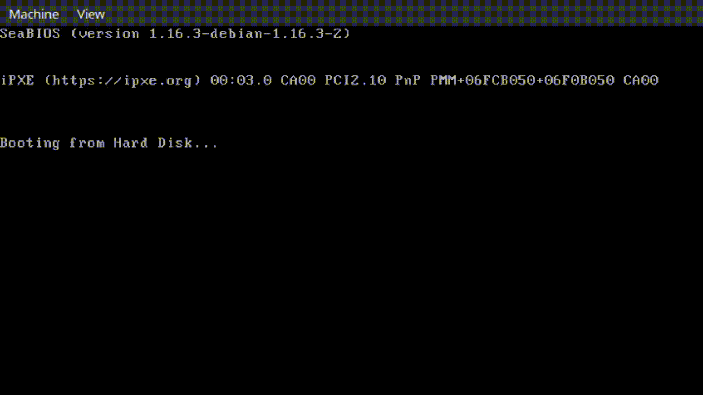

# CanvasBoot

A simple bootloader written in x86-64 Flat Assembler which functions as a canvas.

## Usage:

Use the arrow keys to move the cursor. Use space to enable/disable write mode (buggy).

## Tools:

* Compilation: 
>fasm bootloader.asm
* Emulation:
> qemu-system-x86_64 bootloader.bin
